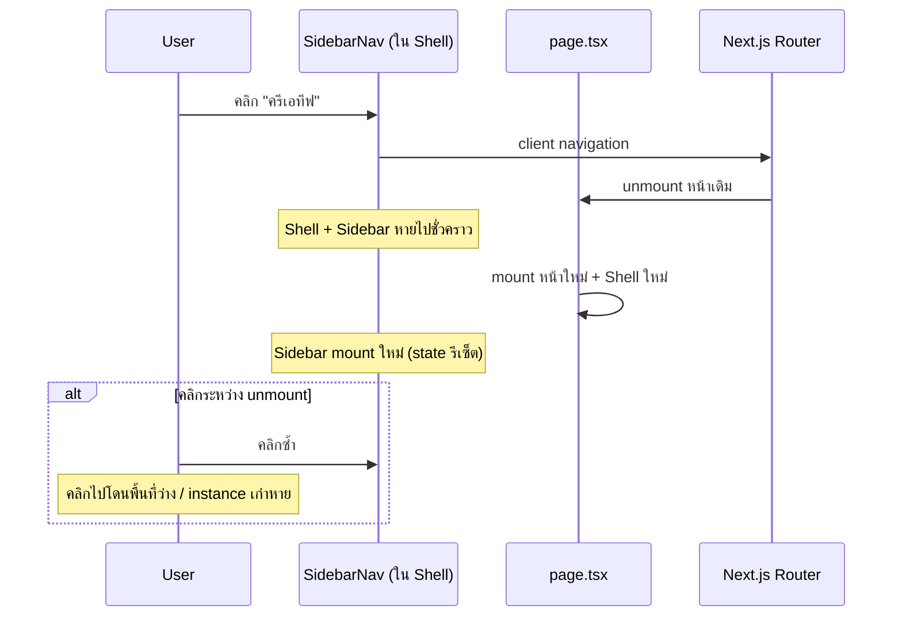
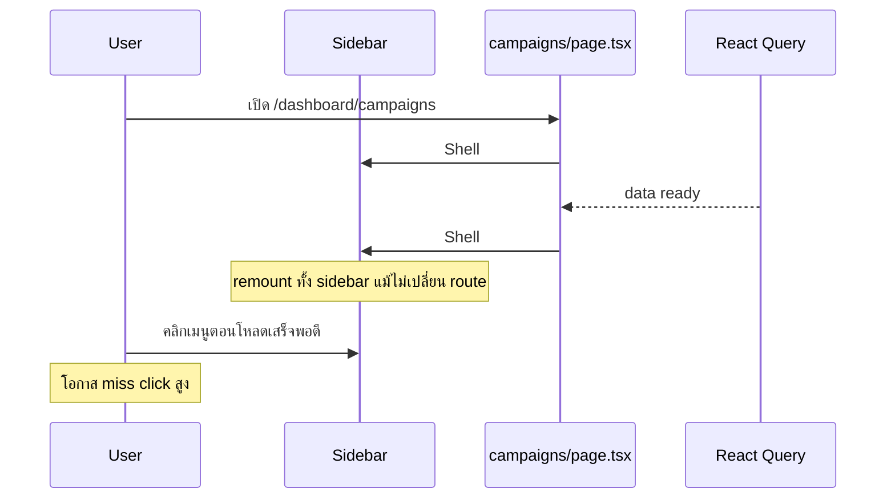

# แผนแก้ปัญหาเมนู Sidebar กดแล้วไม่ตอบสนอง (บางครั้งต้องกดซ้ำ)

| ฟิลด์ | ค่า |
|--------|-----|
| **วันที่** | 2026-06-04 |
| **สถานะ** | **Implemented** (2026-06-04) |
| **ขอบเขต** | `apps/web` — SidebarNav, AppShell, Shell, dashboard pages |
| **อ้างอิง** | `docs/plans/2026-06-04-shadcn-ui-redesign.md` §G4 (layout ชั้นเดียว) |
| **Production** | https://fb-ads.minstance.cloud/ |

---

## 1. อาการที่รายงาน

- กดรายการใน **เมนูด้านข้าง** (Sidebar) แล้ว **บางครั้งไม่เปลี่ยนหน้า**
- ต้อง **กดซ้ำ 2–3 ครั้ง** ถึงจะไปหน้าที่ต้องการ
- เกิดไม่สม่ำเสมอ (intermittent) — มักรู้สึกตอน **เพิ่งเข้าหน้า** หรือ **ข้อมูลยังโหลดอยู่**

---

## 2. สรุปสาเหตุ (เรียงตามความน่าจะเป็น)

| # | สาเหตุ | ความน่าจะเป็น | หลักฐานจากโค้ด |
|---|--------|----------------|----------------|
| **A** | **`Shell` / `AppShell` / `SidebarNav` ถูก remount บ่อย** — ทั้งตอนเปลี่ยน route และตอน loading → loaded ในหน้าเดิม | **สูงมาก** | ทุก `page.tsx` ห่อ `<Shell>` เอง; 9+ หน้าแยก `if (loading) return <Shell>…` กับ `return <Shell>…` คนละ instance |
| **B** | กดเมนูที่ **active อยู่แล้ว** (Next.js `Link` ไม่ navigate) | **สูง** (เข้าใจผิดเป็น bug) | `isActive` ใช้ `pathname === href` หรือ `startsWith`; กด "ภาพรวม" ตอนอยู่ `/dashboard` หรือ "แคมเปญ" ตอนอยู่ `/dashboard/campaigns` ไม่มีการเปลี่ยน URL |
| **C** | **`AnimatePresence mode="wait"`** หน่วง swap เนื้อหา ~250ms หลังเปลี่ยน route | **กลาง** | `AppShell.tsx` — รู้สึกว่า “ค้าง” แต่ sidebar ไม่ควรถูกบังถ้าไม่ remount (แต่ตอนนี้ remount อยู่ดี) |
| **D** | **Mobile:** overlay / sidebar `fixed` ปิดไม่สมบูรณ์ | **กลาง (มือถือ)** | `SidebarNav` — backdrop `z-40`, sidebar `fixed`, ไม่มี `pointer-events-none` ตอนปิด |
| **E** | **Modal / dropdown** ค้างทับหน้าจอ (`z-50`) | **ต่ำ–กลาง** | `Modal.tsx`, `AccountSwitcher` dropdown; กด sidebar ตอน modal เปิด = ถูกบัง (พฤติกรรมปกติ) |
| **F** | `AccountProvider` ซ้อน 2 ชั้น | **ต่ำ** (ไม่กินคลิกโดยตรง) | `dashboard/layout.tsx` + `AppShell.tsx` |

**ข้อสรุป:** ปัญหาหลักคือ **สถาปัตยกรรม layout ผิดชั้น** (เมนูอยู่ใน page แทน layout) ไม่ใช่ bug ของ `<Link>` อย่างเดียว

---

## 3. ไดอะแกรมพฤติกรรมปัจจุบัน





---

## 4. หลักฐานใน repo (อ้างอิงไฟล์)

### 4.1 Shell อยู่ในแต่ละหน้า ไม่ใช่ layout

```12:17:apps/web/src/components/Shell.tsx
export default function Shell({ children, onSync, syncing }: ShellProps) {
  return (
    <AppShell onSync={onSync} syncing={syncing}>
      {children}
    </AppShell>
  );
}
```

`dashboard/layout.tsx` มีแค่ `AccountProvider` — **ไม่มี** sidebar:

```5:7:apps/web/src/app/dashboard/layout.tsx
export default function DashboardLayout({ children }: { children: React.ReactNode }) {
  return <AccountProvider>{children}</AccountProvider>;
}
```

### 4.2 Remount ตอน loading เสร็จ (ตัวอย่าง campaigns)

```465:476:apps/web/src/app/dashboard/campaigns/page.tsx
  if (isLoading) {
    return (
      <Shell>
        ...
      </Shell>
    );
  }

  return (
    <Shell>
```

หน้าที่มี pattern เดียวกัน: `page.tsx` (overview `fbLoading`), `campaigns`, `creatives`, `audiences`, `budget`, `schedules`, `rules`, `analytics`, `notifications`, `abtest`.

### 4.3 Sidebar เป็น Next.js Link ปกติ

```83:87:apps/web/src/components/layout/SidebarNav.tsx
              <Link
                key={item.href}
                href={item.href}
                onClick={onNavigate}
```

ไม่มี `preventDefault` — พฤติกรรม “ไม่ไปไหน” เมื่อ URL เป้าหมาย = URL ปัจจุบัน เป็น **default ของ Next.js**

### 4.4 Animation หลังเปลี่ยน route

```31:35:apps/web/src/components/layout/AppShell.tsx
              <AnimatePresence mode="wait">
                <PageTransition key={pathname}>
                  <div className="px-4 sm:px-6 py-6 max-w-[1600px] mx-auto w-full">{children}</div>
                </PageTransition>
              </AnimatePresence>
```

---

## 5. วิธี reproduce (ให้ทีมยืนยันก่อนแก้)

| # | ขั้นตอน | ผลที่คาดหวังตอนนี้ | บ่งชี้สาเหตุ |
|---|---------|---------------------|--------------|
| R1 | เปิด `/dashboard/campaigns` รอโหลดเสร็จ → กด "แคมเปญ" อีกครั้ง | **ไม่เปลี่ยนหน้า** | B |
| R2 | เปิด `/dashboard` → กด "ภาพรวม" | **ไม่เปลี่ยนหน้า** | B |
| R3 | เปิด `/dashboard/campaigns` → ทันทีที่ขึ้น "Loading…" กดเมนูอื่นเร็วๆ | อาจไม่ไป / ต้องกดซ้ำ | A |
| R4 | เปลี่ยนจาก "แคมเปญ" → "ครีเอทีฟ" ช้าๆ แล้วกดเมนูถัดไปภายใน ~300ms | อาจรู้สึกค้าง | A + C |
| R5 | เปิด modal ยืนยันลบบน campaigns → กด sidebar | **ไม่ไป** | E (ปกติ) |
| R6 | มือถือ: เปิดเมนู hamburger → ปิด → กดลิงก์ | บางครั้งแปลกๆ | D |

### 5.1 วิธียืนยันทางเทคนิค (หลังมี dev build)

1. React DevTools → เลือก `SidebarNav` → สังเกต **tree remount** (highlight กระพริบ) ตอน:
   - เปลี่ยน route ระหว่าง dashboard
   - โหลดข้อมูลเสร็จในหน้าเดิม
2. Performance recording → คลิกเมนู 5 ครั้งเร็วๆ → ดูว่ามีช่วงที่ไม่มี component รับ pointer event

---

## 6. แผนแก้ไข (PR แยก — ยังไม่ทำ)

### PR-1 — **Hoist layout (แก้หลัก A + F)** — Priority P0

**เป้าหมาย:** Sidebar + TopBar + `AccountProvider` ชั้นเดียว ไม่ remount เมื่อเปลี่ยนหน้าหรือโหลดข้อมูล

| งาน | รายละเอียด |
|-----|------------|
| 1 | สร้าง `apps/web/src/app/dashboard/dashboard-shell.tsx` (client) หรือย้าย logic เข้า `dashboard/layout.tsx` ให้ render `<AppShell>{children}</AppShell>` |
| 2 | ลบ `<Shell>` ออกจากทุก `page.tsx` (12 หน้า) — เหลือแค่เนื้อหา + skeleton **ภายใน** children |
| 3 | รวม `AccountProvider` เหลือ **หนึ่งที่** (ใน layout หรือใน AppShell อย่างใดอย่างหนึ่ง) |
| 4 | ย้าย `onSync` / `syncing` ของ TopBar: แนะนำให้ `TopBar` หรือ hook `useOverviewSync()` ตรวจ `pathname === '/dashboard'` แทน prop จาก overview page |
| 5 | Deprecate / ลบ `Shell.tsx` หลัง migrate |

**Acceptance:**

- เปลี่ยน route ระหว่าง dashboard → `SidebarNav` **ไม่** unmount (ตรวจ DevTools)
- โหลด campaigns จบ → sidebar **ไม่** remount
- ฟังก์ชัน sync บน overview ยังทำงาน

**ความสัมพันธ์กับ shadcn plan:** ตรงกับ **G4 / PR-2 layout** ใน `2026-06-04-shadcn-ui-redesign.md` — ทำ PR นี้ก่อนหรือรวมกับ PR-2 ได้

---

### PR-2 — **Loading UI ไม่สลับ Shell (เสริม A)** — Priority P0

| งาน | รายละเอียด |
|-----|------------|
| 1 | แทน `if (loading) return <Shell>…` ด้วย `<Skeleton />` / spinner **ในเนื้อหา** ภายใต้ layout เดิม |
| 2 | `Suspense fallback` ของ campaigns: ใช้ skeleton ใน content area ไม่ใช่ `<Shell>` เต็มชุด |

---

### PR-3 — **UX เมนู active + ความรู้สึก “กดแล้วไม่ไป” (B)** — Priority P1

| งาน | รายละเอียด |
|-----|------------|
| 1 | เมื่อกดเมนูที่ active แล้ว: `router.refresh()` หรือ scroll `#main-content` to top + toast เล็กๆ (optional) |
| 2 | แยก highlight ของ parent vs child (เช่น อยู่ `/campaigns/create` แล้วกด "แคมเปญ" ไป list — ต้อง **navigate ได้** อยู่แล้ว) |
| 3 | เพิ่ม `prefetch={true}` (default) ยืนยันว่าไม่มี `prefetch={false}` |

---

### PR-4 — **Sidebar mobile + overlay (D)** — Priority P2

| งาน | รายละเอียด |
|-----|------------|
| 1 | เมื่อ `!mobileOpen` ใส่ `pointer-events-none` บน `<aside>` (และ `lg:pointer-events-auto`) |
| 2 | ปิดเมนูด้วย `Escape` + lock body scroll ตอนเปิด |
| 3 | ตรวจ z-index: backdrop อยู่ใต้ sidebar แต่เหนือ main |

---

### PR-5 — **ลด animation ขวาง navigation (C)** — Priority P2 (optional)

| ตัวเลือก | ผล |
|---------|-----|
| เปลี่ยน `mode="wait"` → `mode="sync"` หรือลบ `AnimatePresence` | เปลี่ยนหน้าเร็วขึ้น |
| จำกัด animation เฉพาะ opacity ไม่เลื่อน `y` | ลด layout shift |
| ปิด transition เมื่อ `prefers-reduced-motion` | a11y |

---

### PR-6 — **Regression tests** — Priority P1

| งาน | รายละเอียด |
|-----|------------|
| 1 | Playwright: คลิก sidebar สลับ 5 route ติดกัน → URL เปลี่ยนทุกครั้ง |
| 2 | Playwright: เปิด campaigns ระหว่าง mock slow API → คลิก "ครีเอทีฟ" ครั้งเดียว → ไปหน้าถูก |
| 3 | (ถ้ามี) unit test `isActive()` edge cases |

---

## 7. สิ่งที่ยังไม่ทำในแผนนี้

- ไม่เปลี่ยน design system / shadcn (รอแผน redesign)
- ไม่แก้ modal z-index ทั้งแอป (เว้นแต่พบว่าค้างหลังปิด — แก้แยก)
- ไม่รวม PR กับ restricted accounts / campaign bugs

---

## 8. ลำดับแนะนำ

```
PR-1 (hoist AppShell) + PR-2 (loading skeleton)
    → deploy → ให้ user ลอง reproduce R3/R4
PR-3 (active link UX)
PR-6 (e2e)
PR-4, PR-5 ตามความจำเป็น
```

**ประมาณ effort:** PR-1+2 ~ 0.5–1 วัน, PR-3+6 ~ 0.5 วัน

---

## 9. เกณฑ์ปิด issue

- [ ] กดเปลี่ยนเมนู 10 ครั้งติดกัน (desktop) ไม่มีครั้งที่ URL ไม่เปลี่ยน (ยกเว้นกดเมนู active โดยตั้งใจ)
- [ ] หลังเข้าหน้า campaigns รอโหลด กดเมนูอื่นครั้งเดียวสำเร็จ
- [ ] React DevTools: `SidebarNav` ไม่ remount เมื่อเปลี่ยน route / โหลดข้อมูลเสร็จ
- [ ] Playwright PR-6 ผ่านใน CI

---

## 10. คำตอบสั้นๆ สำหรับผู้ใช้ (ภาษาไทย)

**เกิดจากอะไร?**  
ส่วนใหญ่เพราะ **แถบเมนูถูกสร้างใหม่ทุกครั้ง** ที่เปลี่ยนหน้าหรือที่ข้อมูลโหลดเสร็จ (เพราะใส่ `Shell` ไว้ในแต่ละหน้าแทนที่จะใส่ใน layout ร่วม) ทำให้คลิกบางจังหวะ “หลุด” ต้องกดซ้ำ — อีกส่วนคือ **กดเมนูที่อยู่หน้านั้นอยู่แล้ว** ระบบจะไม่เปลี่ยน URL (พฤติกรรมปกติของ Next.js)

**จะแก้ยังไง?**  
ย้าย `AppShell` ไปไว้ที่ `dashboard/layout` ให้เมนูอยู่ถาวร และให้หน้าโหลดแค่เนื้อหากลาง ไม่สลับ Shell ทั้งก้อน