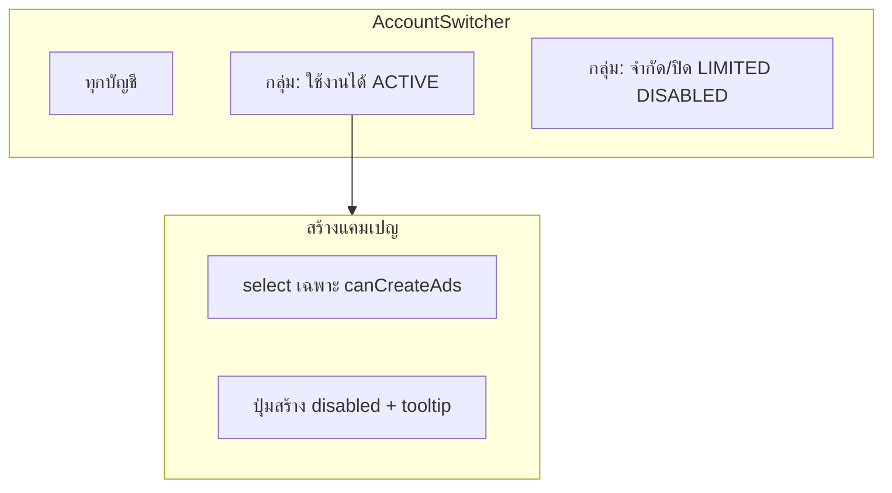
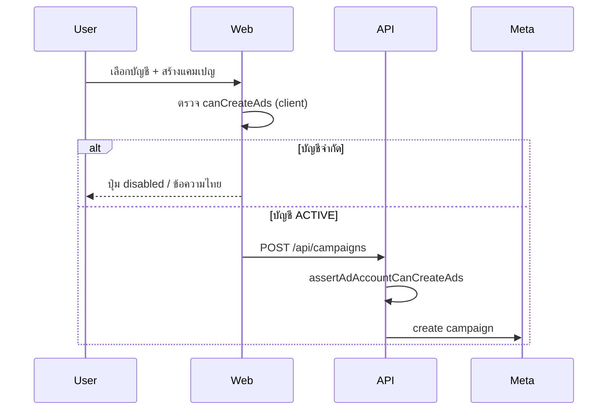

# แผนจัดการบัญชีโฆษณาที่ถูกจำกัด (Restricted Ad Accounts)

| ฟิลด์ | ค่า |
|--------|-----|
| **วันที่** | 2026-06-04 |
| **สถานะ** | Implemented (Hybrid C) — 2026-06-04 |
| **ขอบเขต** | `apps/api` + `apps/web` |
| **อ้างอิง** | Meta Ad Account `account_status`, `disable_reason` |

---

## 1. Overview

ผู้ใช้มีหลาย Ad Account บางบัญชีถูก Meta **จำกัด / ปิด / รอตรวจ** แต่ระบบปัจจุบัน:

- Sync แมป `account_status` → `AdAccount.status` (ACTIVE / LIMITED / DISABLED / BANNED) แล้ว
- **UI ไม่กรอง** — dropdown สร้างแคมเปญ, AccountSwitcher, Analytics แสดงทุกบัญชีเหมือนกัน
- **API ไม่ตรวจ** — `POST /api/campaigns` สร้างได้ถ้ามี `adAccountId` ใน DB แม้ status ไม่ใช่ ACTIVE

ผลคือผู้ใช้เลือกบัญชีที่จำกัด → สร้างแคมเปญไม่สำเร็จ / error จาก Facebook โดยไม่เข้าใจสาเหตุ

**เป้าหมายแผน:** กำหนดนิยาม “บัญชีใช้งานได้” ชัดเจน แล้วกันไม่ให้สร้างแคมเปญบนบัญชีที่จำกัด พร้อม UX ที่ยังเห็นบัญชีปัญหาได้ (อ่านอย่างเดียว) ถ้าต้องการ

---

## 2. สถานะปัจจุบันในโค้ด

| ชั้น | สิ่งที่มี | ช่องว่าง |
|------|----------|----------|
| **Prisma** | `AdAccount.status`: ACTIVE, DISABLED, LIMITED, BANNED | ไม่เก็บ `disable_reason`, `account_status` ดิบจาก Meta |
| **Sync** | `mapAccountStatus()` จาก `account_status` (1→ACTIVE, 9→LIMITED, …) | ไม่ดึง `disable_reason`; ไม่ดึง status 8, 101, 201 ฯลฯ ครบ |
| **API** | `GET /api/adaccounts` ส่ง `status` | ไม่มี `canCreateAds` / ข้อความไทย |
| **Web** | `AdAccount.status` ใน type | ไม่ใช้กรอง UI; ไม่แสดง badge |

```73:82:apps/api/src/sync/sync.service.ts
  private mapAccountStatus(code: number): AccountStatus {
    switch (code) {
      case 1: return 'ACTIVE';
      case 2: return 'DISABLED';
      case 3: return 'BANNED';
      case 7: return 'DISABLED'; // pending review → disabled
      case 9: return 'LIMITED';  // temporarily limited
      case 100: return 'BANNED';
      default: return 'DISABLED';
    }
  }
```

---

## 3. นิยาม “บัญชีใช้งานได้” (ข้อเสนอ)

### 3.1 ระดับความสามารถ (capabilities)

| Capability | ACTIVE | LIMITED | DISABLED | BANNED |
|------------|--------|---------|----------|--------|
| ดูแคมเปญ / insights | ✅ | ✅ | ✅ (ถ้ามีข้อมูล) | ⚠️ ซ่อนหรือแสดงแยก |
| สร้างแคมเปญ / ad set / ad | ✅ | ❌ | ❌ | ❌ |
| Sync ดึงข้อมูล | ✅ | ✅ | ✅ | ✅ |
| เลือกเป็นบัญชีหลัก (default create) | ✅ | ❌ | ❌ | ❌ |
| Bulk spend actions | ✅ | ❌ | ❌ | ❌ |

### 3.2 ฟิลด์คำนวณ (ไม่ต้อง enum ใหม่ใน DB รอบแรก)

```typescript
// apps/api/src/adaccount/ad-account-capabilities.ts (ใหม่)
export function canCreateAds(status: AccountStatus): boolean {
  return status === 'ACTIVE';
}

export function canSpendActions(status: AccountStatus): boolean {
  return status === 'ACTIVE';
}

export function isVisibleInSwitcher(status: AccountStatus): boolean {
  return status !== 'BANNED'; // หรือแสดงทั้งหมดแต่แยกกลุ่ม — ดู OQ1
}
```

**หมายเหตุ Meta:** `account_status === 1` ไม่การันตี 100% ว่าสร้างแคมเปญได้เสมอ (อาจมี policy อื่น) แต่เป็นเกณฑ์มาตรฐานที่ sync ใช้อยู่แล้ว — รอบแรกใช้ `status === ACTIVE`; รอบถัดไปเสริม `disable_reason` / preflight API

---

## 4. ทางเลือก (Alternatives)

### A — กรอง UI อย่างเดียว (แสดงเฉพาะ ACTIVE)

| ข้อดี | ข้อเสีย |
|--------|---------|
| UX เรียบง่าย ไม่เห็นบัญชีปัญหา | ไม่รู้ว่ามีบัญชีถูกจำกัด; bypass ได้ถ้ายิง API ตรง |
| implement เร็ว | |

### B — บล็อก API อย่างเดียว

| ข้อดี | ข้อเสีย |
|--------|---------|
| ปลอดภัย | UI ยังให้เลือกบัญชีจำกัด → error ตอน submit เหมือนเดิม |
| | |

### C — Hybrid (แนะนำ) ✅

1. **UI:** dropdown / switcher แยก “ใช้งานได้” vs “จำกัด/ปิด” (หรือซ่อนจำกัดจาก create แต่แสดงใน switcher พร้อม badge)
2. **API:** guard ทุก mutation ที่ใช้เงิน (create campaign, clone, upload image ฯลฯ)
3. **Sync:** อัปเดต status + `disable_reason` ทุกครั้ง

---

## 5. Proposed Design

### 5.1 Sync & ข้อมูล Meta (PR-1)

ขยาย `fetchAdAccounts` fields:

```
account_status, disable_reason, funding_source_details (optional),
business{name} (optional)
```

เก็บใน DB (migration เล็ก):

| คอลัมน์ | ชนิด | ใช้กับ |
|---------|------|--------|
| `account_status_code` | Int? | ค่าดิบจาก Meta |
| `disable_reason` | Int? | รหัสเหตุถูกจำกัด |
| `status_label_th` | String? | cache ข้อความไทย (optional, จาก mapping) |

ปรับ `mapAccountStatus` ให้ครอบคลุม code เพิ่ม (แนะนำ):

| Meta code | ความหมายโดยทั่วไป | map → |
|-----------|-------------------|--------|
| 1 | ACTIVE | ACTIVE |
| 2 | DISABLED | DISABLED |
| 3 | UNSETTLED | DISABLED |
| 7 | PENDING_RISK_REVIEW | DISABLED |
| 8 | PENDING_SETTLEMENT | LIMITED |
| 9 | IN_GRACE_PERIOD | LIMITED |
| 100 | PENDING_CLOSURE | DISABLED |
| 101 | CLOSED | BANNED |
| อื่นๆ | — | DISABLED |

Mapping `disable_reason` → ข้อความไทยสั้นๆ (ตารางใน code หรือ JSON) สำหรับแสดงใน UI

### 5.2 API (PR-2)

**Shared guard** — `assertAdAccountCanCreateAds(adAccountId, userId)` เรียกก่อน:

- `CampaignsService.create`
- `CampaignsService.clone`
- `uploadAdImage` (ถ้าผูกกับ create flow)
- (optional) warmup auto-create

```typescript
if (!canCreateAds(account.status)) {
  throw new BadRequestException({
    message: 'บัญชีโฆษณานี้ถูกจำกัด ไม่สามารถสร้างแคมเปญได้',
    code: 'AD_ACCOUNT_RESTRICTED',
    status: account.status,
    disableReason: account.disableReason,
  });
}
```

**`GET /api/adaccounts`**

```json
{
  "id": "...",
  "name": "...",
  "status": "LIMITED",
  "canCreateAds": false,
  "restrictionMessage": "บัญชีอยู่ในช่วงจำกัดชั่วคราว (Grace period)"
}
```

Query params (optional):

- `?usableOnly=true` — เฉพาะ ACTIVE (สำหรับ create form)
- default — ส่งครบ + flags (สำหรับ switcher แบบแยกกลุ่ม)

**`GET /api/campaigns/accounts`** — เมื่อรวมบัญชีใน hub:

- กรองแคมเปญของบัญชี non-ACTIVE ออกจาก default **หรือ** ใส่ `accountStatus` ใน payload ให้ UI แสดง banner

### 5.3 Web UI (PR-3)



| จุด | พฤติกรรม |
|-----|-----------|
| **AccountSwitcher** | แสดงทุกบัญชี (ยกเว้น BANNED ถ้า OQ1=ซ่อน); badge สีตาม status; บัญชีจำกัดเลือกได้เพื่อ **ดู** ข้อมูล |
| **Create campaign** (`/campaigns/create`, drawer) | `<select>` เฉพาะ `canCreateAds`; ถ้าไม่มี ACTIVE เลย → empty state + ลิงก์ไป Ads Manager |
| **ปุ่ม “+ สร้างแคมเปญ”** | disable เมื่อ `selectedAccountId` ชี้บัญชีที่ `!canCreateAds` |
| **AccountContext** | ถ้า localStorage ชี้บัญชีจำกัด → reset เป็น `all` หรือบัญชี ACTIVE แรก |
| **Overview** | การ์ดบัญชีจำกัดแยกส่วน “ต้องแก้ไข” พร้อม `restrictionMessage` |

**ไม่ทำรอบแรก:** บล็อกการดูแคมเปญของบัญชีจำกัด (ยังดูได้เพื่อตรวจสอบ)

### 5.4 แผนภาพการไหลของ create (หลัง implement)



---

## 6. Goals & Non-Goals

### Goals

- ผู้ใช้สร้างแคมเปญได้เฉพาะบัญชี **ACTIVE**
- เห็นเหตุผลที่บัญชีถูกจำกัด (status + ข้อความไทย)
- API กัน bypass ไม่ให้สร้างผ่าน curl/Postman

### Non-Goals (รอบนี้)

- แก้บัญชีจำกัดบน Meta (ต้องทำใน Business Manager)
- Preflight ทุก action กับ Meta Marketing API ก่อน submit (phase 2)
- แจ้งเตือน Telegram เมื่อบัญชีเปลี่ยนเป็น LIMITED (phase 2)

---

## 7. PR Plan

| PR | ชื่อ | ขอบเขต | Depends |
|----|------|--------|---------|
| **PR-1** | Data + sync | migration `account_status_code`, `disable_reason`; ขยาย sync fields; ปรับ map; helper `canCreateAds` | — |
| **PR-2** | API guards | `assertAdAccountCanCreateAds`; ขยาย `GET /api/adaccounts`; create/clone/upload guard | PR-1 |
| **PR-3** | Web UX | AccountSwitcher กลุ่ม+badge; create/select กรอง; ปุ่มสร้าง disable; context reset | PR-2 |
| **PR-4** | Campaigns hub | กรอง/แสดง banner บัญชีจำกัด; bulk create ปิดเมื่อ selection มีบัญชีจำกัด | PR-3 |
| **PR-5** *(optional)* | Overview + i18n | การ์ด “บัญชีต้องแก้ไข”; ตาราง `disable_reason` ครบ | PR-1 |

**ลำดับแนะนำ:** PR-1 → PR-2 → PR-3 (ขั้นต่ำใช้งานได้) → PR-4

---

## 8. Key Decisions (ข้อเสนอ — รอ sign-off)

| # | การตัดสินใจ | เหตุผล |
|---|-------------|--------|
| KD1 | ใช้ **Hybrid (C)** ไม่ใช่กรอง UI อย่างเดียว | ปลอดภัย + UX ชัด |
| KD2 | `canCreateAds` = `status === ACTIVE` เท่านั้น | สอดคล้อง sync ปัจจุบัน; LIMITED/DISABLED ชัด |
| KD3 | Switcher **ยังแสดง** บัญชีจำกัด (แยกกลุ่ม) | ผู้ใช้รู้ว่ามีบัญชีแต่ใช้สร้างไม่ได้ |
| KD4 | Create form **ไม่แสดง** บัญชีจำกัดใน dropdown | ลด error ก่อน submit |
| KD5 | เก็บ `disable_reason` จาก Meta | ข้อความอธิบายได้แม่นขึ้น |

---

## 9. Open Questions (ต้องตัดสินใจก่อน implement)

| # | คำถาม | **Default ถ้าไม่ตอบ** |
|---|--------|----------------------|
| OQ1 | บัญชี **BANNED** แสดงใน switcher ไหม? | **แสดง** ในกลุ่ม “ปิดถาวร” แต่ไม่ให้เลือกสร้าง |
| OQ2 | บัญชี **LIMITED** ดูแคมเปญเก่าได้ไหม? | **ได้** (read-only) |
| OQ3 | เมื่อเลือก “ทุกบัญชี” รวมแคมเปญจากบัญชีจำกัดไหม? | **รวม** แต่แสดง badge status ในตาราง |
| OQ4 | ต้องการ toggle “แสดงบัญชีที่ปิดแล้ว” ใน Settings ไหม? | **ไม่** รอบแรก |
| OQ5 | Sync บัญชี CLOSED (101) ลบออกจาก DB หรือเก็บเป็น BANNED? | **เก็บ BANNED** ไม่ลบอัตโนมัติ |

---

## 10. ความเสี่ยง

| ความเสี่ยง | การลด |
|-----------|--------|
| Meta code ใหม่ไม่ตรง map | เก็บ `account_status_code` ดิบ + default DISABLED |
| บัญชี ACTIVE แต่ Meta ยัง reject create | Phase 2: catch error แล้วแนะนำ; optional preflight |
| localStorage ชี้บัญชีจำกัด | PR-3 reset context หลังโหลด accounts |

---

## 11. สรุปคำแนะนำ

**ไม่ควรเลือกอย่างใดอย่างหนึ่งอย่างเดียว** — แนะนำ:

1. **แสดงเฉพาะบัญชี ACTIVE ใน flow สร้างแคมเปญ** (dropdown / default account)
2. **แสดงบัญชีจำกัดใน switcher แยกกลุ่ม** พร้อม badge + ข้อความไทย
3. **API บล็อก create** เสมอแม้ client ถูก bypass

ถ้าต้องการ UX เรียบที่สุด (ไม่เห็นบัญชีปัญหาเลย): ใช้ OQ1 + ซ่อน DISABLED/LIMITED จาก switcher — แลกกับความโปร่งใส

---

## References

- [Meta Ad Account — account_status](https://developers.facebook.com/docs/marketing-api/reference/ad-account/)
- โค้ดปัจจุบัน: `apps/api/src/sync/sync.service.ts`, `apps/api/src/adaccount/adaccount.controller.ts`, `apps/web/src/components/layout/AccountSwitcher.tsx`