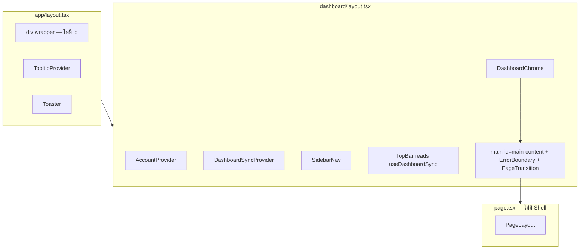
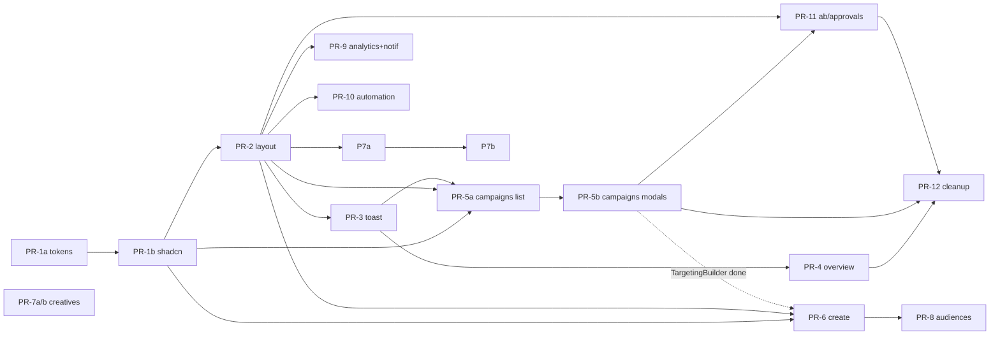
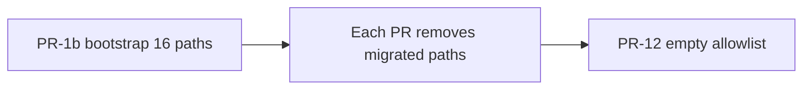

# แผน Design System + shadcn/ui Standardization — FB Ads Platform (Web)

| ฟิลด์ | ค่า |
|--------|-----|
| **วันที่** | 2026-06-04 |
| **สถานะ** | **Approved — รอ implement** (rev. 5) — OQ1–OQ7 ยืนยันแล้ว 2026-06-04 |
| **ขอบเขต** | `apps/web` (Next.js 14 App Router) |
| **อ้างอิง** | UX/IA redesign: `docs/plans/2026-06-04-ux-ui-redesign.md` (implement แล้ว) |
| **Production** | https://fb-ads.minstance.cloud/ |
| **Repo** | `/mnt/f/0P/fb-ads-platform` |
| **Review** | `/tmp/grok-design-review-67bc319f.md` (round 1–4: **34 addressed**, 0 wontfix) |

---

## 1. Overview (ภาพรวม)

โปรเจกต์มี **โครง IA และ layout ใหม่แล้ว** แต่ **ชั้น visual ยังผสมสองระบบ**: utility classes ใน `globals.css` (`.card`, `.btn-primary`, `.msg-error`) กับ shadcn primitives ที่ติดตั้งแล้วแต่ใช้น้อยมาก

**แผนนี้** ไม่ redesign flow ใหม่ — โฟกัสที่:

1. **Design system ที่สอดคล้อง shadcn/Tailwind** (base-nova + neutral)
2. **ย้าย legacy → idiomatic components** ทีละ PR (แยก PR ใหญ่เป็นชิ้น review ได้)
3. **รักษา dark minimal aesthetic** (Vercel black + brand blue `#0070f3`)
4. **ลด technical debt**: Shell ซ้ำ, toast คู่, Modal คู่ Dialog, `<main>` ซ้ำ, token `accent` ปน

---

## 2. Background (บริบท)

### 2.1 สิ่งที่ทำแล้ว (UX/IA — ไม่ทำซ้ำ)

จาก `docs/plans/2026-06-04-ux-ui-redesign.md`: AppShell, TopBar, SidebarNav, PageLayout, AutomationLayout, Campaigns hub, Stepper, DataTable, StatusBadge, ConnectionBanner, copy ไทย

### 2.2 สถานะเทคนิคที่ตรวจจาก repo (2026-06-04)

| หัวข้อ | ผลตรวจ |
|--------|--------|
| shadcn config | `components.json`: **base-nova**, `baseColor: neutral`, `cssVariables: true` |
| shadcn ที่ติดตั้ง | `button`, `badge`, `card`, `dialog`, `dropdown-menu`, `input`, `select`, `separator`, `skeleton`, `sonner`, `tooltip`, `sheet` + app: `DataTable`, `StatusBadge`, `Stepper`, `ConnectionBanner` |
| Legacy ใน dashboard pages | **~157** hits (ดู methodology ด้านล่าง) |
| Legacy ใน shared `src/components/**` (ไม่รวม `ui/card.tsx`) | **~15** hits ใน layout/shared ที่ยังใช้ `.card` / `.btn-*` |
| shadcn import ใน pages | น้อย: `dropdown-menu`, `StatusBadge`, `Stepper`, `ConnectionBanner` |
| `react-hook-form` / `zod` | **ไม่มี** ใน `apps/web/package.json` |
| `@tanstack/react-table` | **ไม่มี** — phase 2 (default) |
| Toast | `ToastProvider` + sonner; `useToast` แค่ overview |
| Modal | หนักใน campaigns, creatives, audiences, abtest |
| Layout | 12 routes import `Shell` → `AppShell`; `AccountProvider` ซ้ำ; **`<main>` ซ้ำ** (root + AppShell) |
| Routes | 15 `page.tsx`; 3 redirect → **12 หน้าเนื้อหา** |
| `budget-preview` drift | `:root` `#737373` vs `tailwind.config` `#a3a3a3` — แก้ใน PR-1a |
| Fonts | Geist จาก `fonts.cdnfonts.com` — ย้าย `next/font` ใน PR-1a |

#### วิธีนับ legacy (methodology)

```bash
# จาก apps/web — นับทุก hit ไม่ใช่ unique files
rg -c '\b(btn-primary|btn-secondary|btn-ghost|btn-danger|msg-success|msg-error|msg-info)\b' \
  src/app/dashboard --glob '*.tsx'
# + className ที่มี token card (quoted + template literals):
rg -c 'className=.*\bcard\b' src/app/dashboard --glob '*.tsx'
rg -c 'className=\{\s*[`'\''][^`'\'']*\bcard\b' src --glob '*.tsx'
# ผลรวม ~157 utility + ~40+ className card (quoted + backtick — 2026-06-04)

# ไม่รวม: btn-sm, btn-xs (map เป็น Button size)
# Gate script ใช้ pattern ใน §3.1 (quoted + `` className={`card`} ``)
```

| Route | Legacy hits | หมายเหตุ |
|-------|-------------|----------|
| campaigns | 27 | + modals, TargetingBuilder |
| overview | 20 | รวม stat cards |
| creatives | 22 | 3 modals |
| audiences | 17 | |
| analytics | 15 | |
| notifications | 14 | มี `setMsg` / banners เพิ่ม — ความซับซ้อน ≈ analytics |
| create | 8 | |
| abtest | 9 | PageHeader |
| approvals | 6 | |
| rules / schedules / budget | 6–7 | ผ่าน AutomationLayout |

**ลำดับความสำคัญ P6/P7:** analytics กับ notifications ใกล้เคียง (~15 vs ~14 legacy + form/filter complexity) — **ทำคู่ใน PR-9** ไม่แยกลำดับสลับ

---

## 3. Goals & Non-Goals

### 3.1 Goals (เป้าหมาย)

| # | เป้าหมาย | วัดความสำเร็จ |
|---|----------|----------------|
| G1 | shadcn เป็นหลักใน dashboard + shared ที่ pages ใช้ | ดู **Incremental legacy gates** + `check-legacy-ui.sh` (§3.1) + สรุป PR-12 |
| G2 | Tokens ไม่ปน brand vs surface | Token table §4.1; `check-brand-tokens.sh` หลัง PR-1a (§3.1) |
| G3 | Form + feedback มาตรฐาน | rhf+zod; sonner เท่านั้น |
| G4 | Layout ชั้นเดียว | หนึ่ง sidebar, topbar, `<main>`, **หนึ่ง `#main-content`**; ไม่มี `Shell` |
| G5 | dark minimal + semantic meta/estimate/budget | Playwright screenshot baseline (§9) |

#### Incremental legacy gates (G1 — บังคับทุก PR ที่แตะ UI)

| หลัง PR | ต้องเป็นจริง |
|---------|----------------|
| PR-3 | ลบ `ConnectionBanner.tsx` จาก allowlist |
| PR-4 | ลบ `dashboard/page.tsx` จาก allowlist |
| PR-5a | `campaigns/page.tsx` ยังใน bootstrap allowlist; gate = **manual list** + Playwright |
| PR-5b | ลบจาก allowlist: `campaigns/page.tsx`, `TemplatesTab.tsx`, `TargetingBuilder.tsx` |
| PR-6 | `campaigns/create/page.tsx`: legacy script ผ่าน; wizard **5 ขั้น** |
| PR-7a/b, PR-8, … | หน้านั้น zero `.btn-primary` + `.card` |
| PR-12 | `check-legacy-ui.sh` ผ่าน **`legacy-ui-allowlist.txt` ว่าง** (เหลือแค่ comments) + `check-brand-tokens.sh` |

#### CI scripts (PR-1b + PR-1a gate)

**`scripts/check-legacy-ui.sh`** — จับ utility classes, `className="card"`, **`className={\`card …\`}`**, และ `cn('card', …)`:

```bash
#!/usr/bin/env bash
# apps/web/scripts/check-legacy-ui.sh
set -euo pipefail
cd "$(dirname "$0")/.."

PATHS=(
  src/app/dashboard
  src/components/layout
  src/components/campaigns
  src/components/TargetingBuilder.tsx
  src/components/ui/DataTable.tsx
  src/components/ui/ConnectionBanner.tsx
)

ALLOWLIST="scripts/legacy-ui-allowlist.txt"
# ไฟล์ใน allowlist ข้ามจนกว่า PR จะลบ entry (เช่น campaigns/page.tsx จน PR-5b)

should_skip() {
  local file="$1"
  [[ -f "$ALLOWLIST" ]] || return 1
  while IFS= read -r line || [[ -n "$line" ]]; do
    [[ "$line" =~ ^[[:space:]]*# ]] && continue
    [[ -z "${line// }" ]] && continue
    [[ "$file" == *"$line"* ]] && return 0
  done < "$ALLOWLIST"
  return 1
}

FAIL=0
while IFS= read -r -d '' f; do
  should_skip "$f" && continue
  if rg -n \
    -e '\b(btn-primary|btn-secondary|btn-ghost|btn-danger)\b' \
    -e '\bmsg-(success|error|info)\b' \
    -e 'className=["'\''][^"'\'']*\bcard\b' \
    -e 'className=\{\s*`[^`]*\bcard\b' \
    -e "className=\\{\\s*'[^']*\\bcard\\b" \
    -e '\bcn\([^)]*['\''"]card\b' \
    "$f"; then
    FAIL=1
  fi
done < <(find "${PATHS[@]}" -type f \( -name '*.tsx' -o -name '*.ts' \) -print0 2>/dev/null)

if [[ "$FAIL" -ne 0 ]]; then
  echo "FAIL: legacy UI classes found (see above)"
  exit 1
fi
echo "OK: no legacy btn/msg/card patterns in scoped paths (allowlist applied)"
```

#### Allowlist bootstrap & lifecycle (PR-1b → PR-12)

**แนวคิด:** `check-legacy-ui.sh` สแกน `PATHS` เต็ม — ไฟล์ที่ยังมี legacy ต้องอยู่ใน allowlist จน PR ที่เกี่ยว **ลบบรรทัด** ออก ไฟล์ที่แก้ใน PR-1b (`DataTable.tsx`, `StatusBadge.tsx`) **ไม่อยู่ใน allowlist** และต้องสะอาดทันที

**PR-1b merge:** `./scripts/check-legacy-ui.sh` ผ่านด้วย **bootstrap allowlist ที่ commit** (ไม่ใช่ไฟล์ว่าง)

**`scripts/legacy-ui-allowlist.txt`** — commit ใน PR-1b:

```text
# Legacy UI allowlist — ลบหนึ่งบรรทัดเมื่อไฟล์ migrate ครบ (legacy grep = 0 ในไฟล์)
# PR-12: เหลือเฉพาะบรรทัด comment (#) — ไม่มี path

# --- dashboard pages (12) ---
src/app/dashboard/page.tsx
src/app/dashboard/campaigns/page.tsx
src/app/dashboard/campaigns/create/page.tsx
src/app/dashboard/creatives/page.tsx
src/app/dashboard/audiences/page.tsx
src/app/dashboard/budget/page.tsx
src/app/dashboard/schedules/page.tsx
src/app/dashboard/rules/page.tsx
src/app/dashboard/analytics/page.tsx
src/app/dashboard/notifications/page.tsx
src/app/dashboard/abtest/page.tsx
src/app/dashboard/approvals/page.tsx

# --- shared / layout ---
src/components/layout/AutomationLayout.tsx
src/components/TargetingBuilder.tsx
src/components/campaigns/TemplatesTab.tsx
src/components/ui/ConnectionBanner.tsx
```

**ไม่อยู่ใน allowlist (สะอาดตั้งแต่ PR-1b):** `DataTable.tsx`, `StatusBadge.tsx`

| PR ที่ merge | ลบจาก allowlist |
|--------------|-----------------|
| PR-1b | *(bootstrap — ไม่ลบ path)* |
| PR-3 | `ConnectionBanner.tsx` |
| PR-4 | `dashboard/page.tsx` |
| PR-5b | `campaigns/page.tsx`, `TemplatesTab.tsx`, `TargetingBuilder.tsx` |
| PR-6 | `campaigns/create/page.tsx` |
| PR-7b | `creatives/page.tsx` |
| PR-8 | `audiences/page.tsx` |
| PR-9 | `analytics/page.tsx`, `notifications/page.tsx` |
| PR-10 | `budget/page.tsx`, `schedules/page.tsx`, `rules/page.tsx`, `AutomationLayout.tsx` |
| PR-11 | `abtest/page.tsx`, `approvals/page.tsx` |
| **PR-12** | **allowlist ว่าง** — ตรวจ: `grep -v '^\s*#' scripts/legacy-ui-allowlist.txt \| grep -q .` → fail |

**PR-5a:** `campaigns/page.tsx` อยู่ใน bootstrap แล้ว — **ไม่เพิ่ม** บรรทัดใน PR-5a

**PR-5a manual gate** (list ในไฟล์ที่ยัง allowlisted):

- [ ] แท็บ list + ตาราง: ไม่มี `btn-primary` / `className="card"` / `` className={`card`} `` ใน **บล็อก list**
- [ ] Modal blocks ยัง legacy ได้จน PR-5b
- [ ] Playwright `campaigns-list` ผ่าน

**`scripts/check-brand-tokens.sh`** (PR-1a merge + หลัง PR-1b ใน paths ที่ migrate):

```bash
#!/usr/bin/env bash
# ห้าม Tailwind brand ผ่าน accent.* นอก shadcn ui/
set -euo pipefail
PATHS=(src/app/dashboard src/components/layout src/components/campaigns \
  src/components/TargetingBuilder.tsx src/components/ui/DataTable.tsx)

if rg -n '\b(bg|text|border|ring)-accent(-[a-z0-9]+)?\b' "${PATHS[@]}"; then
  echo "FAIL: use brand.* not accent.* for Vercel blue in app code"
  exit 1
fi
echo "OK: no Tailwind accent.* brand usage in scoped paths"
```

**Allowlist:** `src/components/ui/**` อาจใช้ shadcn `bg-accent` / `hover:bg-accent` = **muted surface** (`--accent: #1a1a1a`) — script ไม่สแกน `ui/` (ดู §4.1.1)

| หลัง PR | brand gate |
|---------|------------|
| PR-1a | `check-brand-tokens.sh` ผ่านใน paths ที่ rename แล้ว (หรือ allowlist ไฟล์ที่ยังไม่ rename ใน `scripts/brand-migrate-allowlist.txt` ชั่วคราว) |
| PR-1b | bootstrap allowlist; ลบ path ตามตาราง lifecycle เมื่อแต่ละ PR merge |
| PR-5a+ | ไฟล์ที่แตะใน PR ต้อง **ลบออกจาก allowlist** ใน PR เดียวกัน (ยกเว้น PR-5a ที่ campaigns ยังบน allowlist) |

### 3.2 Non-Goals

- Redesign IA (ทำแล้ว)
- Marketing (`app/page.tsx`, `register`) — **PR-13 / epic แยก** (§12); **interim:** แต่ละหน้าใช้ `<main>` ภายใน content (§7.1.2)
- Light mode production — default dark-only (OQ2)
- Mobile app / API
- Shared `packages/shared` zod — phase หลัง (OQ7 default: ไม่รอบนี้)

---

## 4. Design System

### 4.1 Theme strategy & token migration

**กฎ (บังคับ):**

1. **shadcn semantic tokens** → `Button`, `Card`, `Dialog`, `Input` (`bg-primary`, `bg-card`, `bg-accent` ตาม shadcn)
2. **Tailwind `brand.*`** → สีน้ำเงินเดิม (แทน `accent.*` ที่สับสน)
3. **Tailwind `meta` / `estimate` / `budget-preview`** → domain เท่านั้น
4. **Legacy `:root --accent`** → deprecate; brand = `--primary` เท่านั้น

#### Token migration table (PR-1a)

| ก่อน | หลัง | การกระทำ |
|------|------|----------|
| `:root --accent: #0070f3` | ลบหรือ alias `--primary` | ไม่ใช้เป็น brand ใน CSS ใหม่ |
| shadcn ไม่มี `--accent` | `--accent: #1a1a1a`, `--accent-foreground: #f5f5f5` | hover surface ตาม base-nova |
| `tailwind accent.DEFAULT` (#0070f3) | `brand.DEFAULT` / `brand-muted` / `brand-border` | rename ใน config |
| `bg-accent`, `text-accent`, `BulkActionBar` | `bg-brand`, `text-brand`, … | codemod PR-1a/1b + **`check-brand-tokens.sh`** |
| `bg-primary` (shadcn Button) | คง — brand actions | |
| `--budget-preview` #737373 vs tailwind #a3a3a3 | **Single source:** `#a3a3a3` ใน `:root` + tailwind อ้าง `var(--budget-preview)` | PR-1a |
| Domain colors | `--meta`, `--estimate`, `--budget-preview` ใน `:root` | tailwind `colors.*` อ่านจาก var |

```css
/* globals.css — shadcn block (PR-1a) */
:root {
  --primary: #0070f3;
  --primary-foreground: #ffffff;
  --accent: #1a1a1a;           /* surface hover — NOT brand */
  --accent-foreground: #f5f5f5;
  --budget-preview: #a3a3a3;   /* aligned with tailwind */
  --meta: #a78bfa;
  --estimate: #38bdf8;
}
```

```
┌─────────────────────────────────────────────────────────────┐
│  shadcn: --primary (brand), --accent (muted surface)        │
│  tailwind: brand.*, surface.*, ink.*, meta, estimate        │
│  ห้าม: Tailwind accent.* สำหรับ brand หลัง PR-1a            │
└─────────────────────────────────────────────────────────────┘
```

#### 4.1.1 เมื่อไหร่ใช้ `accent` vs `brand` (หลัง PR-1a)

| บริบท | ใช้ได้ | ห้าม |
|--------|--------|------|
| `src/components/ui/**` (shadcn) | `bg-accent`, `hover:bg-accent` = muted surface (`--accent` #1a1a1a) | `bg-accent` แทน primary CTA |
| `src/app/dashboard/**`, `layout/`, `campaigns/`, `DataTable`, `SidebarNav` | `bg-brand`, `text-brand`, `bg-brand-muted` | `(bg\|text\|border\|ring)-accent` สำหรับสีน้ำเงิน Vercel |
| CSS variables | `--primary` = brand; `--accent` = surface | `:root --accent: #0070f3` (legacy brand) |

**Deprecate** `@layer` `.card`, `.btn-*` หลัง **PR-12**

### 4.2 Legacy → shadcn mapping

(ตารางเดิม + เพิ่ม)

| Legacy | shadcn / pattern | หมายเหตุ |
|--------|------------------|----------|
| Global `input, select, textarea` | shadcn `Input` / `Select` | **PR-1a:** scope เป็น `.legacy-surface input` หรือ `[data-legacy-form]` |
| Global `table/th/td` | shadcn `Table` | **PR-1a:** `.legacy-surface table` — ห้อง shadcn ไม่ inherit |
| `Modal` | `Dialog` / `AlertDialog` | ดู **Modal migration checklist** ด้านล่าง |
| `@/components/Skeleton` | shadcn `Skeleton` หรือ wrapper | **PR-4** |

#### Global CSS scoping (PR-1a — ก่อน PR-6 forms)

```css
/* ย้ายจาก blanket input/table — ใช้เฉพาะภายใน wrapper */
.legacy-surface input,
.legacy-surface select,
.legacy-surface textarea { /* rules เดิมจาก globals @layer */ }

.legacy-surface table,
.legacy-surface th,
.legacy-surface td { /* rules เดิม */ }

/* INTERIM จน PR-13: login + register ยังไม่มี legacy-surface wrapper
   คง global input แบบเดิมเพื่อไม่ให้ฟอร์ม marketing หักโหมด */
.login-page input,
.login-page select,
.login-page textarea,
.register-page input,
.register-page select,
.register-page textarea { /* ชุดเดียวกับ .legacy-surface input — ลบใน PR-13 */ }

/* shadcn ใช้ data-slot จาก base-ui */
[data-slot="input"] { @apply shadow-none; /* reset legacy ถ้าจำเป็น */ }
```

**ห้าม:** ย้าย rules ไป `.legacy-surface` อย่างเดียวโดยไม่มี wrapper + ไม่มี interim block ด้านบน → input ทั้งแอปจะไม่มี border/focus

#### PR-1a — `.legacy-surface` rollout (ลำดับบังคับ)

| ลำดับ | ไฟล์ / route | งาน PR-1a | หลัง PR |
|-------|----------------|-----------|---------|
| 1 | `globals.css` | ย้าย input/table → `.legacy-surface`; เพิ่ม `.login-page` / `.register-page` interim | PR-13 ลบ interim |
| 2 | **Dashboard** (`AppShell.tsx` inner div ที่ `px-4 sm:px-6 py-6 …`) | เพิ่ม `className="legacy-surface …"` **ใน PR-1a เดียวกับ CSS** | PR-2 ย้าย class ไป `DashboardChrome` div เดิม |
| 3 | `app/page.tsx` (login) | เพิ่ม root `className="login-page"` (ไม่จำเป็นต้องมี `legacy-surface`) | PR-13 → shadcn `Input` |
| 4 | `app/register/page.tsx` | เพิ่ม root `className="register-page"` | PR-13 |
| 5 | Marketing shadcn | — | **PR-13** ลบ `.login-page` / `.register-page` rules + ใช้ `Input` |

**ไม่ครอบคลุมใน PR-1a:** หน้า `/`, `/register` **ไม่** ต้องห่อ `legacy-surface` — ใช้ **global `.login-page` / `.register-page` selectors** จน PR-13 (ตรงกับ non-goal marketing)

**Acceptance (PR-1a):**

- [ ] หลัง merge: `/dashboard` overview — input ยังมี border + focus ring (ผ่าน `legacy-surface` ใน AppShell)
- [ ] `/` login และ `/register` — input ยังมี border + focus ring (ผ่าน `.login-page` / `.register-page` **ไม่ใช่** unstyled bare input)
- [ ] shadcn `Input` ใน PR-1b smoke test ไม่ inherit legacy shadow ซ้อน

**Acceptance (Dialog + Form — PR-6+):** Input ใน `Dialog` + `Form` — focus ring เดียว

#### Modal migration checklist (ทุก modal ใน PR-5b, 7b, 8, 11)

- [ ] `role="dialog"` + `aria-modal="true"` (Radix Dialog ให้อัตโนมัติ)
- [ ] `DialogTitle` / `aria-labelledby`
- [ ] Focus trap + ESC ปิด
- [ ] **Focus restore** ไป trigger หลังปิด
- [ ] Scroll lock body
- [ ] Destructive confirm → `AlertDialog` (ไม่ใช้ `Dialog` ธรรมดา)
- [ ] ลบ framer-motion overlay ยกเว้น optional `Dialog` animation ของ shadcn

### 4.3 Typography — Geist

| | |
|-|-|
| ปัจจุบัน | CDN `fonts.cdnfonts.com` |
| PR-1a | `import { GeistSans, GeistMono } from 'geist/font'` ใน `layout.tsx`; ลบ `@import url(...)` |
| Risk | CSP ไม่ต้อง allowlist CDN; build offline ได้ (§9) |

### 4.4–4.5 Spacing & Elevation

ไม่เปลี่ยน — Card padding มาตรฐาน `p-6`; AutomationLayout ใช้ `<Card>` ใน PR-10

---

## 5. Component Inventory

### 5.1 ติดตั้งแล้ว

`button`, `badge`, `card`, `dialog`, `dropdown-menu`, `input`, `select`, `separator`, `skeleton`, `sonner`, `tooltip`, `sheet`

### 5.2 shadcn add (แบ่งตาม PR)

| PR | add |
|----|-----|
| PR-1b | `alert`, `tabs`, `table`, `label`, `alert-dialog` |
| PR-6 | `form`, `checkbox`, `popover`, `command`, `textarea` |
| PR-9 | `switch` |
| Phase 2 | `calendar`, `date-picker` |

### 5.3 Dependencies

```bash
pnpm --filter web add react-hook-form @hookform/resolvers zod   # PR-6
# pnpm --filter web add @tanstack/react-table                    # phase 2 (OQ4 default)
```

### 5.4 Shared components — owning PR

| Component | PR | งาน |
|-----------|-----|------|
| `StatusBadge` | PR-1b | Badge + cva |
| `DataTable` | PR-1b wrapper; PR-5a Table | ลบ `.card`, `btn-ghost` ใน BulkActionBar |
| `ConnectionBanner` | PR-3 | Alert |
| `TemplatesTab` | PR-5b | Dialog, Button |
| `TargetingBuilder` | **PR-5b** | Popover+Command (ไม่เลื่อน PR-12) |
| `AutomationLayout` | PR-10 | Card panes |
| `PageLayout` | PR-4+ | Breadcrumb optional |
| `Skeleton.tsx` | **PR-4** | ห่อ shadcn `Skeleton` |

---

## 6. Page-by-Page Migration Matrix

### 6.1 Dashboard routes

| Prio | Route | Legacy ~hits | PR | งานหลัก |
|------|-------|--------------|-----|---------|
| P0 | Foundation | globals | PR-1a, PR-1b | tokens, scope CSS, shadcn batch |
| P0 | Layout | — | PR-2 | DashboardChrome, SyncContext, single main |
| P1 | `/dashboard` | 20 | PR-4 | Cards, Alert, sonner, Skeleton |
| P2a | `/dashboard/campaigns` list | ~15* | PR-5a | Tabs, Table, Alerts/toast, DataTable |
| P2b | campaigns modals | ~12* | PR-5b | Dialogs, TargetingBuilder, TemplatesTab |
| P3 | `/dashboard/campaigns/create` | 8 | PR-6 | rhf+zod + `campaign-create-shared` |
| P4a | creatives list | ~12* | PR-7a | Cards, buttons |
| P4b | creatives modals | ~10* | PR-7b | 3× Dialog |
| P5 | audiences | 17 | PR-8 | Dialogs, forms (หลัง PR-6) |
| P6 | analytics + notifications | 15+14 | PR-9 | Tabs, Table, Switch |
| P7 | rules / schedules / budget | 6–7 | PR-10 | AutomationLayout Cards |
| P8 | abtest + approvals | 9+6 | PR-11 | PageLayout, Dialog |
| — | redirects | — | — | — |

\*แยกโดยประมาณจากไฟล์รวม — วัดด้วย legacy gate ต่อ PR

### 6.2 Shared / layout (บังคับใน matrix)

| Component | Legacy | PR |
|-----------|--------|-----|
| `DataTable.tsx` | `.card`, `btn-ghost` | PR-1b, PR-5a |
| `AutomationLayout.tsx` | `.card` ×2 | PR-10 |
| `TemplatesTab.tsx` | btn/card | PR-5b |
| `TargetingBuilder.tsx` | inputs | PR-5b |
| `StatusBadge.tsx` | `.badge-*` | PR-1b |
| `TopBar.tsx` | อาจมี btn | PR-2 หรือ PR-4 |
| `EmptyState`, `ErrorBoundary` | `.card` / btn | PR-12 |

---

## 7. Architecture

### 7.1 Layout consolidation — `DashboardChrome` (PR-2, merge blocker)

**ห้าม:** ใส่ `AppShell` เต็มใน `dashboard/layout` ขณะที่ pages ยังใช้ `<Shell>` → **sidebar/topbar ซ้ำ**

**ลำดับ PR-2 (ทำในครั้งเดียว):**

1. สร้าง `components/layout/DashboardChrome.tsx` (client)
2. ย้าย sidebar + topbar + padding จาก `AppShell` เข้า Chrome
3. `dashboard/layout.tsx` ห่อ `AccountProvider` + `DashboardSyncProvider` + `DashboardChrome`
4. **ลบ `import Shell` จากทั้ง 12 dashboard routes ใน PR เดียวกัน**
5. `Shell.tsx` → re-export children only (`export default function Shell({ children }) { return children; }`) ชั่วคราว **หรือลบทันที** ถ้า PR-2 ครบทุก route
6. ลบ `AccountProvider` จาก Chrome ภายใน (เหลือแค่ใน layout)
7. **Single `#main-content` + single `<main>` landmark (dashboard):**
   - `app/layout.tsx`: `<div className="…">` **ไม่มี** `id="main-content"` (หลีกเลี่ยง id ซ้ำบน dashboard)
   - `DashboardChrome`: `<main id="main-content">` **เจ้าเดียว** บนเส้นทาง `/dashboard/*` — skip link ชี้ตรงนี้
   - ย้าย `ErrorBoundary` + `AnimatePresence` + `PageTransition` จาก `AppShell.tsx` เข้า `<main>` (พฤติกรรมเดิม)

```tsx
// components/layout/DashboardChrome.tsx
'use client';

import { AnimatePresence } from 'framer-motion';
import { usePathname } from 'next/navigation';
import ErrorBoundary from '@/components/ErrorBoundary';
import { PageTransition } from '@/components/motion-wrapper';
import { useDashboardSync } from '@/contexts/dashboard-sync-context';
import SidebarNav from './SidebarNav';
import TopBar from './TopBar';

export function DashboardChrome({ children }: { children: React.ReactNode }) {
  const pathname = usePathname();
  const isCreateFlow = pathname.startsWith('/dashboard/campaigns/create');
  const { onSync, syncing } = useDashboardSync();

  return (
    <div className="flex min-h-screen bg-background">
      <SidebarNav />
      <div className="flex-1 flex flex-col min-w-0">
        {!isCreateFlow && <TopBar onSync={onSync} syncing={syncing} />}
        <main id="main-content" className="flex-1 overflow-x-hidden">
          <ErrorBoundary>
            <AnimatePresence mode="wait">
              <PageTransition key={pathname}>
                <div className="legacy-surface px-4 sm:px-6 py-6 max-w-[1600px] mx-auto w-full">
                  {children}
                </div>
              </PageTransition>
            </AnimatePresence>
          </ErrorBoundary>
        </main>
      </div>
    </div>
  );
}
```

```tsx
// app/layout.tsx (PR-2) — ไม่ใส่ id ที่ wrapper
<a href="#main-content">Skip to main content</a>
<Providers>
  <div className="min-h-screen">{children}</div>
</Providers>
```

```tsx
// app/dashboard/layout.tsx
'use client';

export default function DashboardLayout({ children }: { children: React.ReactNode }) {
  return (
    <AccountProvider>
      <DashboardSyncProvider>
        <DashboardChrome>{children}</DashboardChrome>
      </DashboardSyncProvider>
    </AccountProvider>
  );
}
```

**Acceptance (PR-2):**

- [ ] ทุก dashboard route: **sidebar 1, topbar 1, `<main>` 1**
- [ ] เอกสาร HTML: **`#main-content` ปรากฏเพียงครั้งเดียว** บน dashboard (DevTools → duplicate id = fail)
- [ ] ไม่มี nested `AppShell` / `Shell` ที่ mount chrome
- [ ] Create flow ยังซ่อน TopBar
- [ ] Skip link โฟกัสเข้า `DashboardChrome` `<main id="main-content">`
- [ ] Route transition + `ErrorBoundary` ยังทำงานเหมือน `AppShell` เดิม

### 7.1.1 `DashboardSyncContext` (PR-2)

ไฟล์: `src/contexts/dashboard-sync-context.tsx` — **export** เฉพาะ provider + hooks ด้านล่าง; `DashboardSyncSetterContext` เป็น **internal** (ไม่ export)

```tsx
'use client';

import {
  createContext,
  useCallback,
  useContext,
  useEffect,
  useMemo,
  useState,
  type ReactNode,
  type Dispatch,
  type SetStateAction,
} from 'react';

export interface DashboardSyncValue {
  onSync?: () => void | Promise<void>;
  syncing?: boolean;
}

const DashboardSyncContext = createContext<DashboardSyncValue>({});
const DashboardSyncSetterContext = createContext<
  Dispatch<SetStateAction<DashboardSyncValue>>
>(() => {});

export function DashboardSyncProvider({ children }: { children: ReactNode }) {
  const [value, setValue] = useState<DashboardSyncValue>({});
  return (
    <DashboardSyncSetterContext.Provider value={setValue}>
      <DashboardSyncContext.Provider value={value}>
        {children}
      </DashboardSyncContext.Provider>
    </DashboardSyncSetterContext.Provider>
  );
}

export function useDashboardSync(): DashboardSyncValue {
  return useContext(DashboardSyncContext);
}

/** หน้า overview (หรือหน้าที่ต้องการ sync) — ต้องส่ง handlers ที่ stable */
export function useRegisterDashboardSync(handlers: DashboardSyncValue): void {
  const setValue = useContext(DashboardSyncSetterContext);
  const stable = useMemo(
    () => ({ onSync: handlers.onSync, syncing: handlers.syncing }),
    [handlers.onSync, handlers.syncing],
  );
  useEffect(() => {
    setValue(stable);
    return () => setValue({});
  }, [setValue, stable.onSync, stable.syncing]);
}
```

```tsx
// app/dashboard/page.tsx — บังคับ useCallback เพื่อไม่ reset sync ทุก render
const triggerSync = useMutation({ ... });

const handleSync = useCallback(() => {
  if (fbStatus?.connected) triggerSync.mutate();
}, [fbStatus?.connected, triggerSync.mutate]);

useRegisterDashboardSync({
  onSync: fbStatus?.connected ? handleSync : undefined,
  syncing: triggerSync.isPending,
});
```

`TopBar` อ่าน `useDashboardSync()` — ไม่มี `onSync` → **ซ่อน** ปุ่ม Sync (default)

### 7.1.2 Non-dashboard landmarks (จนกว่า PR-13)

หลัง PR-2 root ไม่มี `<main>`:

- **`app/page.tsx`**, **`app/register/page.tsx`**: ห่อเนื้อหาด้วย `<main id="main-content">` ภายในหน้า (interim a11y)
- Skip link จาก root ยังใช้ `#main-content` — บน marketing ชี้ `<main>` ในหน้า; บน dashboard ชี้ `DashboardChrome`
- **Known debt:** marketing ยังไม่ shadcn — แก้เต็มใน **PR-13**; บันทึกใน §9 risks

### 7.2 Single toast (PR-3)

ลบ `ToastProvider`; `lib/toast.ts` re-export `sonner`; overview ใช้ `toast.success/error`

### 7.3 Form pattern & `campaign-create-shared.ts` (PR-6)

**ไม่สร้าง state คู่ขนาน** — zod schema เป็น source of validation; map กับ type เดิม:

```tsx
// lib/schemas/campaign-create.ts
import { z } from 'zod';
import type { CampaignFormState } from '@/lib/campaign-create-shared';

export const campaignCreateSchema = z.object({
  adAccountId: z.string().min(1),
  name: z.string().min(1),
  objective: z.string(),
  dailyBudget: z.number().positive(),
  // ... ฟิลด์ 1:1 กับ CampaignFormState
});

export type CampaignCreateInput = z.infer<typeof campaignCreateSchema>;

/** แปลง form → API payload — คง logic เดิมจาก create page */
export function toCampaignPayload(data: CampaignCreateInput): CampaignFormState {
  return data as CampaignFormState;
}
```

- `CREATE_STEPS`, `OBJECTIVES`, `initialCampaignForm()` **ยังอยู่** ใน `campaign-create-shared.ts`
- PR-6: แทน `useState` กระจายด้วย `useForm<z.infer<typeof schema>>` + `defaultValues: initialCampaignForm()`
- อนาคต: ย้าย schema ไป `packages/shared` (OQ7 default: ไม่ทำรอบนี้)

### 7.4 DataTable

PR-1b: markup `Table`; PR-5a: campaigns; TanStack = phase 2

### 7.5 Component hierarchy



### 7.6 Migration phases



---

## 8. Alternatives Considered

### 8.1 Incremental (เลือก) vs Full rewrite

**Decision:** Incremental

### 8.2 base-nova (เลือก) vs new-york

**Decision:** คง base-nova

### 8.3 Dark-only (เลือก) vs Light toggle

**Decision:** dark-only รอบนี้; `next-themes` เมื่อ OQ2 เปลี่ยน

### 8.4 Legacy-only freeze vs shadcn-only-new-pages

| ทางเลือก | ผล |
|----------|-----|
| **Legacy freeze** (ไม่ migrate) | คง dual toast/modal/token; ทุก PR ใหม่ยังสับสนว่าใช้ `.btn-primary` หรือ `<Button>` — **ปฏิเสธ** |
| **shadcn เฉพาะหน้าใหม่** | หน้าเก่ายัง legacy → worst of both worlds; G1 ไม่มีทางถึง 90% — **ปฏิเสธ** |
| **Incremental migrate (เลือก)** | ต้นทุนสpread แต่ลด debt ถาวร; สอดคล้อง IA ที่มีแล้ว |

---

## 9. Risks & Rollout

| Risk | Mitigation |
|------|------------|
| Double chrome (PR-2) | ลบ Shell ทุก route ใน PR เดียว; acceptance sidebar×1 |
| Duplicate `#main-content` | Root `div` ไม่มี id; id เฉพาะ `DashboardChrome` `<main>` |
| Visual regression | **Playwright** + auth fixture (ด้านล่าง) |
| Global input/table หายหลัง PR-1a | Rollout §4.2: `legacy-surface` บน AppShell + `.login-page`/`.register-page` interim จน PR-13 |
| Token accent/brand ผิด | `check-brand-tokens.sh` + allowlist §4.1.1 |
| CDN font / CSP | PR-1a `next/font`; ลบ cdnfonts; CSP self-host fonts only |
| AccountProvider | เหลือที่ `dashboard/layout` ชั้นเดียว |
| Marketing ไม่มี landmark | Interim `<main id="main-content">` ใน page จน PR-13 (§7.1.2) |

### Visual regression — minimum (PR-4+ merge criteria)

```bash
pnpm --filter web add -D @playwright/test
```

| Spec | Route |
|------|-------|
| `e2e/visual/overview.spec.ts` | `/dashboard` |
| `e2e/visual/campaigns-list.spec.ts` | `/dashboard/campaigns` |
| `e2e/visual/campaigns-create-step1.spec.ts` | `/dashboard/campaigns/create` |
| `e2e/visual/automation-rules.spec.ts` | `/dashboard/rules` |

- เก็บ baseline ใน `apps/web/e2e/visual/__screenshots__/`
- CI (หรือ manual ก่อน merge): `playwright test e2e/visual` — **ต้อง authenticated**
- **Fail PR** ถ้า diff > threshold โดยไม่มี approval
- Optional phase 2: Storybook สำหรับ `StatusBadge`, `DataTable`, `PageLayout`

### E2E auth (บังคับก่อน PR-4 visual gates)

Middleware (`src/middleware.ts`) บังคับ cookie **`fb_ads_token`** สำหรับ `/dashboard/*` — ไม่มี token จะ redirect ไป `/` (snapshot หน้า login แทน dashboard)

**โครงสร้าง:**

```
apps/web/
  e2e/
    auth.setup.ts          # globalSetup — ออก token / cookie
    .auth/storageState.json
    visual/
      overview.spec.ts
  playwright.config.ts
```

```ts
// playwright.config.ts (สรุป)
import { defineConfig, devices } from '@playwright/test';

export default defineConfig({
  globalSetup: require.resolve('./e2e/auth.setup.ts'),
  use: {
    baseURL: process.env.PLAYWRIGHT_BASE_URL ?? 'http://localhost:3000',
    storageState: 'e2e/.auth/storageState.json',
  },
  projects: [{ name: 'chromium', use: { ...devices['Desktop Chrome'] } }],
});
```

```ts
// e2e/auth.setup.ts — เลือกหนึ่งแบบ
import { chromium, type FullConfig } from '@playwright/test';

async function globalSetup(config: FullConfig) {
  const baseURL = config.projects[0].use.baseURL as string;
  const browser = await chromium.launch();
  const context = await browser.newContext();

  // Option A (แนะนำ CI): inject cookie ตรง — ตรง middleware
  const token = process.env.E2E_FB_ADS_TOKEN;
  if (!token) throw new Error('E2E_FB_ADS_TOKEN required for dashboard e2e');

  await context.addCookies([
    {
      name: 'fb_ads_token',
      value: token,
      url: baseURL,
      httpOnly: true,
      sameSite: 'Lax',
    },
  ]);

  // Option B (local): UI login แล้ว save storageState
  // const page = await context.newPage();
  // await page.goto(baseURL);
  // ... fill login → wait for /dashboard

  await context.storageState({ path: 'e2e/.auth/storageState.json' });
  await browser.close();
}

export default globalSetup;
```

| Env var | ใช้เมื่อ |
|---------|----------|
| `E2E_FB_ADS_TOKEN` | Cookie injection (CI / local) — JWT หรือ token ที่ API ยอมรับ |
| `E2E_EMAIL` / `E2E_PASSWORD` | Option B UI login (ถ้ามี test user) |
| `PLAYWRIGHT_BASE_URL` | default `http://localhost:3000` |
| `E2E_SKIP_AUTH=1` | **เฉพาะ dev:** bypass ถ้าเพิ่ม `middleware` test branch (ไม่ใช้ production) |

**Merge criteria PR-4+:** visual specs โหลด `/dashboard` ได้ (ไม่ redirect `/`); assert `page.url()` contains `/dashboard`

**Verification ทุก PR:**

```bash
pnpm --filter web type-check && pnpm --filter web build && pnpm --filter web lint
./scripts/check-brand-tokens.sh    # หลัง PR-1a (paths ที่ migrate)
./scripts/check-legacy-ui.sh       # หลัง PR-1b
pnpm --filter web exec playwright test e2e/visual   # PR-4+ (ต้องมี E2E_FB_ADS_TOKEN)
```

---

## 10. Open Questions + Defaults (ใช้ได้ทันทีถ้ายังไม่ตอบ)

| # | คำถาม | **Default ถ้าไม่ตอบ** | ผลต่อ PR |
|---|--------|----------------------|----------|
| OQ1 | Brand primary | **คง `#0070f3`** | PR-1a `--primary` |
| OQ2 | Light mode Q3 2026 | **ไม่ — dark-only** | ไม่สร้าง `.light` pair ใน PR-1a |
| OQ3 | Density | **Comfortable** (ปัจจุบัน) | Button `default`, table `py-3` |
| OQ4 | TanStack Table | **Phase 2** (หลัง PR-12) | PR-5a ใช้ shadcn Table อย่างเดียว |
| OQ5 | shadcn Sidebar | **คง SidebarNav custom** | ไม่มี PR |
| OQ6 | Marketing รวมแผน | **แยก PR-13 / epic** | หลัง PR-12; interim `<main>` §7.1.2 |
| OQ7 | shared zod package | **ไม่รอบนี้** | schema ใน `apps/web` อ้าง `CampaignFormState` |

**Sign-off (2026-06-04):** ยืนยันตามตารางทั้งหมด (OQ1–OQ7) — **ยังไม่เริ่ม implement**

| OQ | การตัดสินใจ |
|----|-------------|
| OQ1 | Brand `#0070f3` |
| OQ2 | Dark-only |
| OQ3 | Comfortable density |
| OQ4 | TanStack Table → Phase 2 |
| OQ5 | คง `SidebarNav` custom |
| OQ6 | Marketing แยก PR-13 |
| OQ7 | zod ใน `apps/web` ไม่แยก package |

---

## 11. Key Decisions (rev. 3)

| Decision | Rationale |
|----------|-----------|
| `DashboardChrome` + ลบ Shell ทุก route ใน PR-2 | ป้องกัน double chrome |
| `#main-content` เฉพาะบน dashboard `<main>` | root `div` ไม่มี id — ไม่ duplicate id |
| ErrorBoundary + PageTransition ใน Chrome | พฤติกรรมเท่า `AppShell` เดิม |
| `brand.*` + `check-brand-tokens.sh` | แยก brand จาก shadcn `bg-accent` ใน `ui/` |
| Bootstrap allowlist | PR-1b commit 16 paths; ลดทีละ PR; PR-12 ว่าง |
| `check-legacy-ui.sh` | จับ quoted + `` className={`card`} ``; skip allowlisted paths |
| PR-1a surface rollout | AppShell `legacy-surface`; login/register `.login-page` interim จน PR-13 |
| Playwright + `fb_ads_token` cookie | middleware ไม่ให้ snapshot login page |
| `useRegisterDashboardSync` + `useCallback` | ไม่ reset TopBar sync ทุก render |
| Marketing interim `<main>` | a11y จน PR-13 |
| PR-12 cleanup / PR-13 marketing | เลข PR ต่อเนื่อง ไม่ข้าม 12–13 |

---

## 12. PR Plan (13 implementation PRs + PR-1a/b split = 15 merge units)

> **หมายเหตุเลข PR:** PR-12 = legacy cleanup, PR-13 = marketing (เดิมเรียก PR-14/PR-15 ใน rev. 2)

| PR | ชื่อ | ขอบเขต | Depends | Merge criteria |
|----|------|--------|---------|----------------|
| **PR-1a** | Tokens, fonts, CSS scope + **surface rollout** | `next/font`; token table; `brand.*`; scope CSS; **`legacy-surface` on AppShell inner div**; **`login-page` / `register-page` roots**; interim global input จน PR-13; `check-brand-tokens.sh` | — | login + dashboard inputs styled; brand script OK |
| **PR-1b** | shadcn batch + shared primitives | alert/tabs/…; `StatusBadge`; `DataTable`; `lib/toast.ts`; **`check-legacy-ui.sh`** + **bootstrap `legacy-ui-allowlist.txt`** (§3.1) | PR-1a | script ผ่าน; DataTable/StatusBadge ไม่ listed; allowlist committed |
| **PR-2** | DashboardChrome + a11y | Chrome + **ErrorBoundary/PageTransition**; ย้าย **`legacy-surface`** จาก AppShell → Chrome inner div; ลบ Shell ทุก route; root `div` **ไม่มี id**; marketing interim `<main>` | PR-1a | sidebar×1; **one `#main-content`**; dashboard inputs still styled |
| **PR-3** | Feedback | ลบ ToastProvider; ConnectionBanner → Alert | PR-1b | sonner บน overview |
| **PR-4** | Overview | Cards, Buttons, Alert; Skeleton → shadcn; **Playwright auth setup** | PR-2, PR-3 | legacy gate; visual + authenticated URL |
| **PR-5a** | Campaigns — list | Tabs, Table, bulk bar, msg→Alert/toast (`campaigns` อยู่ใน bootstrap allowlist แล้ว) | PR-1b, PR-2, PR-3 | manual list gate + Playwright |
| **PR-5b** | Campaigns — modals + targeting | Dialogs; TargetingBuilder; TemplatesTab; **ลบ allowlist entry** | PR-5a | `check-legacy-ui.sh` ผ่าน `campaigns/page.tsx` ทั้งไฟล์ |
| **PR-6** | Create campaign | rhf+zod + `CampaignFormState` | PR-1b, PR-2 | **ครบ `CREATE_STEPS.length` (5) ขั้น** + submit; Playwright step1 |
| **PR-7a** | Creatives — shell | list/grid, buttons | PR-2 | partial gate |
| **PR-7b** | Creatives — modals | 3× Dialog | PR-7a | full gate |
| **PR-8** | Audiences | Dialogs, forms, upload | PR-2, PR-6 | create flows |
| **PR-9** | Analytics + Notifications | Tabs, Table, Switch | PR-2, PR-1b | optional visual |
| **PR-10** | Automation trio | AutomationLayout Cards, AlertDialog | PR-2, PR-1b | Playwright rules |
| **PR-11** | A/B + Approvals | PageLayout; Dialog | PR-2, PR-5b | |
| **PR-12** | Legacy cleanup | ลบ Modal, Toast, PageHeader, Shell, globals `@layer`; **allowlist ว่าง** | PR-4–11 | `check-legacy-ui.sh` + empty allowlist; `check-brand-tokens.sh` |
| **PR-13** *(optional)* | Marketing | `page.tsx`, `register` shadcn + landmark | PR-12 | epic `#ui-marketing-legacy` |

**Parallelization:**

- หลัง **PR-2**: PR-7a, PR-9, PR-10 คู่ขนานได้
- **PR-8** หลัง PR-6 — ไม่ parallel กับ PR-7
- **PR-4** ต้องมี `e2e/auth.setup.ts` ก่อนใช้ visual เป็น gate

---

## Appendix A — File references

| Path | หมายเหตุ |
|------|----------|
| `src/lib/campaign-create-shared.ts` | `CampaignFormState` — zod map 1:1 |
| `src/components/Shell.tsx` | ลบ PR-2 |
| `src/app/layout.tsx` | `<div>` wrapper **ไม่มี** `id="main-content"` PR-2 |
| `src/middleware.ts` | `AUTH_COOKIE = fb_ads_token` — Playwright §9 |
| `e2e/auth.setup.ts` | cookie / storageState |
| `src/components/layout/AppShell.tsx` | PR-1a: `legacy-surface` inner div; PR-2: แทนที่ด้วย DashboardChrome |
| `scripts/legacy-ui-allowlist.txt` | Bootstrap PR-1b; shrink per PR; **empty PR-12** (§3.1 lifecycle) |
| `app/page.tsx`, `app/register/page.tsx` | PR-1a: `login-page` / `register-page`; PR-13 shadcn |

---

## Appendix B — Acceptance checklist (ก่อนปิด PR-12)

### Layout & providers
- [ ] ไม่มี `import Shell` ใน `src/app/dashboard/**`
- [ ] `Shell.tsx` ถูกลบ
- [ ] **Exactly one `#main-content` in document** on dashboard routes (Validator / DevTools)
- [ ] `<main>` landmark เดียวใน `DashboardChrome`; `ErrorBoundary` + `PageTransition` ทำงาน
- [ ] `AccountProvider` ชั้นเดียวใน `dashboard/layout`
- [ ] Marketing: interim `<main id="main-content">` หรือ PR-13 เสร็จ

### Feedback & modals
- [ ] ไม่มี `ToastProvider` / `useToast`
- [ ] ไม่มี `import` จาก `Modal.tsx` ใน dashboard + `TemplatesTab` + `TargetingBuilder`

### Legacy classes & tokens
- [ ] `./scripts/check-legacy-ui.sh` ผ่าน (quoted + template `` `card` ``)
- [ ] `scripts/legacy-ui-allowlist.txt` **ว่าง** (ไม่มี path — เหลือแค่ `#` comments)
- [ ] `./scripts/check-brand-tokens.sh` ผ่าน (scoped paths; `ui/` excluded per §4.1.1)

### Build & E2E
- [ ] `pnpm --filter web build` ผ่าน
- [ ] Playwright visual 4 specs ผ่าน **with `E2E_FB_ADS_TOKEN`** (URL ไม่ใช่ `/`)
- [ ] Create campaign: **5 ขั้น** (`CREATE_STEPS`) + mobile Automation list/detail

---

---

## Appendix C — `legacy-ui-allowlist.txt` lifecycle (scripts)



| ขั้น | การกระทำ |
|------|----------|
| PR-1b | Commit bootstrap (§3.1); `check-legacy-ui.sh` ใน CI |
| PR-3 … PR-11 | ลบ path ของไฟล์ที่ migrate ใน PR description checklist |
| PR-12 | ยืนยัน allowlist ว่าง + ลบไฟล์ allowlist ได้ (optional) หรือเก็บไฟล์มีแต่ header comment |

**ตรวจ allowlist ว่าง (PR-12):**

```bash
! grep -v '^\s*#' scripts/legacy-ui-allowlist.txt | grep -q .
```

---

*เอกสาร rev. 5 — allowlist bootstrap; พร้อม PR-1a หลังยืนยัน OQ defaults (§10)*